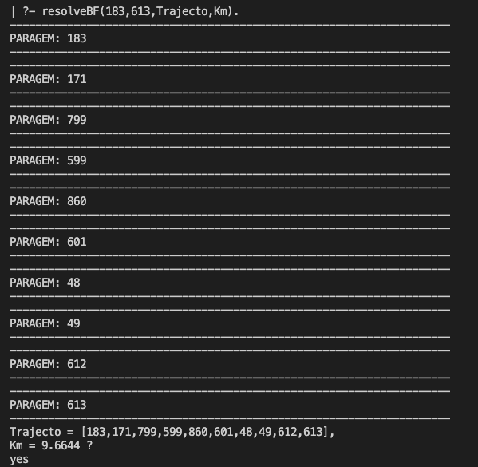
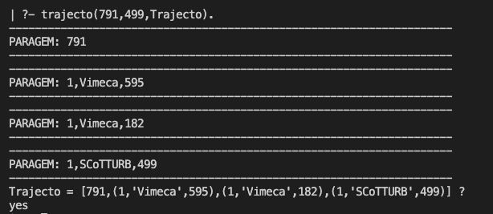

# Sistema-de-Transportes
Sistema de transportes do concelho de Oeiras.

PROBLEMA
========

* Pretende-se que desenvolva um sistema, que permita importar os dados relativos às paragens de autocarro, e representá-los numa base de conhecimento, da forma que julgue mais adequada. Posteriormente, deverá desenvolver um sistema de recomendação de transporte público .

RESULTADO
------------------

------------------

